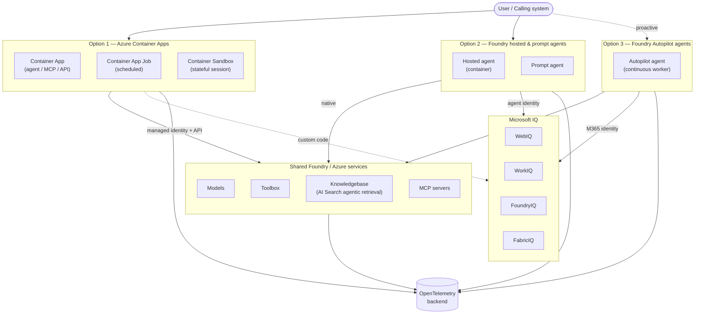
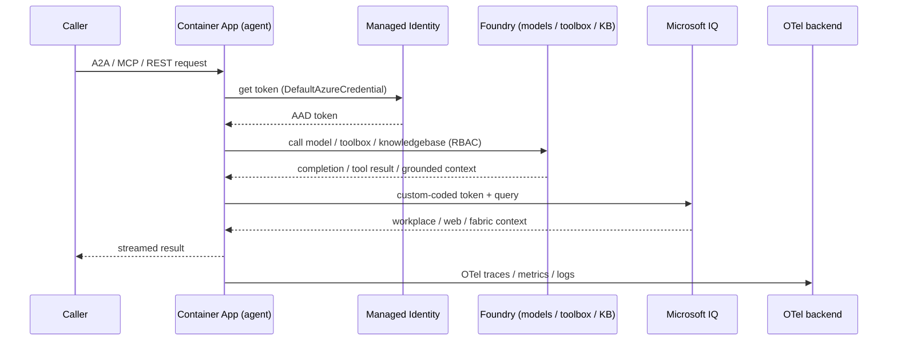
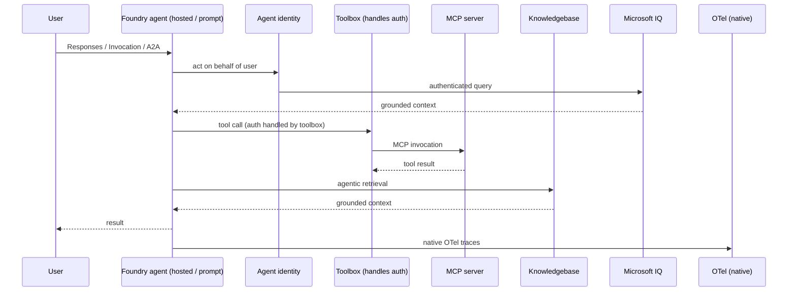
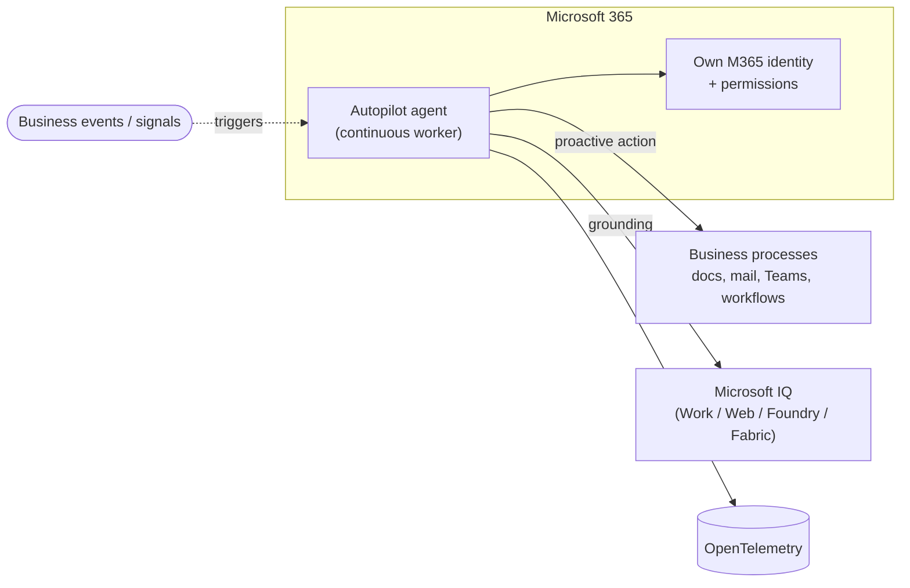
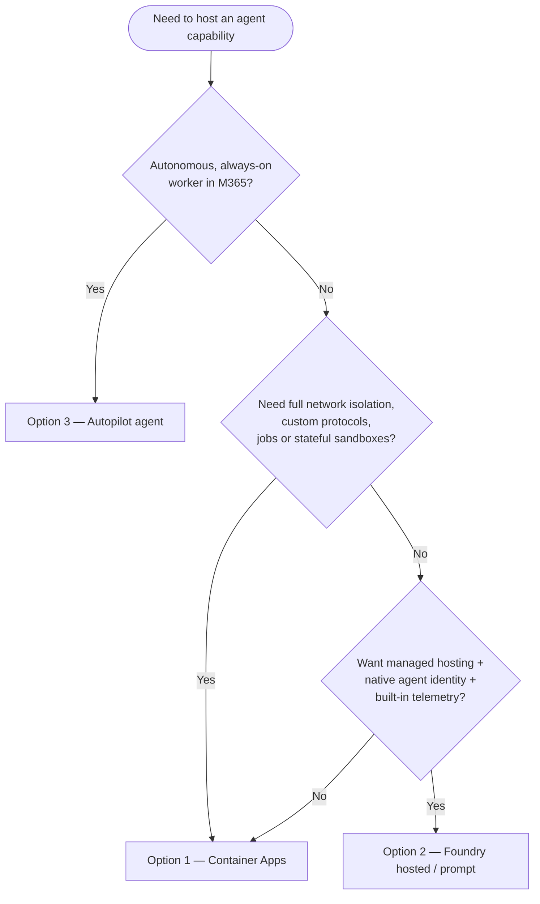

# Agent Hosting Architecture

How to host **agents**, **MCP servers**, **tools / toolboxes**, and
**knowledgebases**, and how they communicate. This document describes the
communication flow, the hosting options, and the protocol & lifecycle support
for three deployment models:

1. **Agents in Azure Container Apps** — agents, jobs, and sandboxes on a
   network-integrated container platform.
2. **Foundry hosted & prompt agents** — agents running inside Azure AI Foundry
   with a native agent identity.
3. **Foundry Autopilot agents** — autonomous digital workers that run
   continuously inside Microsoft 365.

---

## Table of contents

- [Building blocks](#building-blocks)
- [The big picture](#the-big-picture)
- [Option 1 — Agents in Azure Container Apps](#option-1--agents-in-azure-container-apps)
- [Option 2 — Foundry hosted & prompt agents](#option-2--foundry-hosted--prompt-agents)
- [Option 3 — Foundry Autopilot agents](#option-3--foundry-autopilot-agents)
- [Side-by-side comparison](#side-by-side-comparison)
- [Choosing an option](#choosing-an-option)

---

## Building blocks

Before comparing hosting models, it helps to define the four artifacts that
every option arranges differently.

| Building block | What it is | In this repo |
| --- | --- | --- |
| **Agent** | A reasoning loop (LLM + orchestration framework) that plans, calls tools, and produces results. | [`src/agents/researcher/agent.py`](../src/agents/researcher/agent.py) |
| **MCP server** | A Model Context Protocol endpoint that exposes tools/resources over `stdio` or streamable HTTP. | [`src/agents/researcher/mcp_server.py`](../src/agents/researcher/mcp_server.py) |
| **Tool / Toolbox** | A single capability (web search, AI Search, function) or a managed *collection* of tools with shared auth. | [`scripts/deploy_toolbox.py`](../scripts/deploy_toolbox.py) |
| **Knowledgebase** | A retrieval surface (agentic retrieval over an Azure AI Search index) that grounds answers in curated content. | [`scripts/create_knowledgebase.py`](../scripts/create_knowledgebase.py) |

These artifacts are **shared infrastructure**: the same Foundry Toolbox and
knowledgebase can be consumed by an agent in Container Apps, a Foundry hosted
agent, or an Autopilot agent. What changes between options is *where the agent
runtime lives*, *what identity it carries*, and *how it reaches these
artifacts*.

### Protocols at a glance

| Protocol | Purpose | Used by |
| --- | --- | --- |
| **A2A** (Agent-to-Agent) | Agent-to-agent invocation, streaming status, human-in-the-loop interrupts. | Container Apps agents, Foundry hosted agents |
| **MCP** (Model Context Protocol) | Tool/resource exposure and consumption. | MCP servers, toolboxes, agents-as-tools |
| **Responses / Invocation API** | OpenAI-compatible request/response and streaming entry point. | Foundry hosted & prompt agents |
| **OpenTelemetry (OTel)** | Distributed tracing, metrics, and logs. | All options |

---

## The big picture

---

## Option 1 — Agents in Azure Container Apps

Azure Container Apps gives you a **fully owned, network-integrated runtime**.
The agent is "just an app": any language, any SDK, any framework. You package
it into a container image (see [`src/agents/researcher/Dockerfile`](../src/agents/researcher/Dockerfile))
and run it as one of three workload shapes.

### Workload shapes

| Shape | Best for | Lifecycle |
| --- | --- | --- |
| **Container App** | Long-running agents, MCP servers, or any API. Scales to zero, scales out on load. | Request- or event-driven; always-addressable HTTP/gRPC endpoint. |
| **Container App Job** | Scheduled or one-shot operations (batch ingestion, nightly research runs). | Triggered by cron, event, or manual start; runs to completion then exits. |
| **Container Sandbox** | Stateful operations needing a dedicated session and a fast local disk. | Per-session, isolated; state persists for the life of the session. |

> **Anything can be exposed.** Because it is a normal container, the same
> workload can simultaneously expose an A2A server
> ([`a2a_server.py`](../src/agents/researcher/a2a_server.py)), an MCP server
> ([`mcp_server.py`](../src/agents/researcher/mcp_server.py)), and a plain REST
> API — all behind the Container Apps ingress.

### Networking & private integration

Container Apps **natively integrate into a private VNet**. The agent, MCP
server, or API can run entirely inside private network boundaries, reach
private endpoints (databases, internal APIs), and be reached only by approved
callers. This is the strongest isolation story of the three options.

### Identity, models, toolboxes & knowledgebases

The container runs under a **managed identity**. With that identity it calls
Foundry over the public/private API to:

- **Consume models** (chat, embeddings) via the Foundry/Azure OpenAI endpoint.
- **Consume the Toolbox** (`researcher-tools`) for web search and AI Search.
- **Query the knowledgebase** (`story-telling-kb`) through the agentic
  retrieval API.

No secrets are stored in the container — `DefaultAzureCredential` resolves the
managed identity and Foundry authorizes the call via RBAC role assignments
(see [`scripts/deploy_helpers.py`](../scripts/deploy_helpers.py)).

### Microsoft IQ access

Container Apps agents **can** authenticate to Microsoft IQ services (WebIQ,
WorkIQ, FoundryIQ, FabricIQ), but it requires **a little custom code**: you
acquire a token for the IQ service and attach it yourself, because there is no
built-in agent-identity blueprint at this layer.

### Telemetry

The agent emits **OpenTelemetry** traces, metrics, and logs to *any* OTel
backend (Application Insights, Grafana/Tempo, a third-party collector). Because
you own the process, you control instrumentation end to end.

### Communication flow

**When to choose Option 1:** you need private networking, full framework
freedom, custom protocols/APIs, scheduled jobs, or stateful sessions, and you
are willing to own identity wiring to Microsoft IQ.

---

## Option 2 — Foundry hosted & prompt agents

Azure AI Foundry hosts the agent runtime for you. Two flavours exist:

- **Prompt agents** — declarative agents defined by a system prompt, output
  schema, and attached tools/toolbox (see
  [`scripts/deploy_prompt_agents.py`](../scripts/deploy_prompt_agents.py)).
- **Hosted agents** — your own container image (agent-framework or LangChain
  orchestration) run *inside* Foundry as a managed container (see
  [`scripts/deploy_hosted_agents.py`](../scripts/deploy_hosted_agents.py)).

### Native agent identity

The defining feature: every Foundry agent has a native **agent identity
blueprint**. It can authenticate and act **on behalf of the user** against
Microsoft IQ services (WebIQ, WorkIQ, FoundryIQ, FabricIQ) with **no custom
token plumbing** — the platform issues and manages the agent identity.

### Frameworks & exposure

Foundry supports **Agent Framework** and **LangChain** as orchestration
frameworks for hosted agents (run as a container). Each agent can **expose**:

- **A2A** — for agent-to-agent invocation and streaming.
- **Responses API** — OpenAI-compatible request/response.
- **Invocation API** — direct agent invocation.

Agents are described by an **AgentCard** with **skills**
([`AgentCardSkill`](../scripts/deploy_hosted_agents.py)), e.g. the researcher's
`architecture-research`, `visualization`, and `memory-management` skills under
[`src/agents/researcher/skills/`](../src/agents/researcher/skills/).

### Consuming tools, toolboxes & knowledgebases

Hosted/prompt agents **consume MCP servers directly**, or go through the
**Toolbox**, which can also **handle authentication on the agent's behalf** —
the agent never sees the underlying credentials. The same Toolbox
(`researcher-tools`) and knowledgebase (`story-telling-kb`) used by Option 1 are
attached natively here.

### Telemetry

Foundry agents **natively publish OpenTelemetry** — tracing is on by the
platform without manual instrumentation.

### Private networking

Foundry **can** integrate into a private network, **with some limitations** —
most notably around the **container registry** used to pull hosted agent
images. Plan network design around that constraint if full isolation is
required.

### Communication flow

**When to choose Option 2:** you want managed hosting, native agent identity
to Microsoft IQ, built-in telemetry, standard A2A/Responses/Invocation
endpoints, and toolbox-managed auth — and the private-networking limitations
are acceptable.

---

## Option 3 — Foundry Autopilot agents

Autopilot agents are a **different category altogether**. They are not just a
runtime or implementation model but a **higher-level concept**: autonomous
digital workers operating within an organisation.

Where Options 1 and 2 describe *how* an agent is hosted and *invoked on
demand*, an Autopilot agent describes a **persistent role**:

- **Long-running & proactive** — runs continuously in the background rather
  than waiting to be called.
- **Acts independently** — initiates work based on business events and
  context, not just user prompts.
- **Owns its identity and permissions in Microsoft 365** — it operates as a
  first-class member of the organisation with its own scoped access.
- **Tightly integrated into business processes** — embedded in workflows
  rather than bolted on as a tool.

**When to choose Option 3:** the goal is an autonomous, always-on digital
worker that participates in M365 business processes under its own identity —
not a request/response service.

---

## Side-by-side comparison

| Dimension | Option 1 — Container Apps | Option 2 — Foundry hosted / prompt | Option 3 — Autopilot |
| --- | --- | --- | --- |
| **Category** | Self-owned runtime | Managed runtime | Autonomous digital worker |
| **Invocation model** | On demand (request/event/schedule) | On demand | Continuous / proactive |
| **Framework freedom** | Any SDK / framework | Agent Framework, LangChain | Platform-defined |
| **Workload shapes** | App, Job, Sandbox | Hosted container, Prompt agent | Background worker |
| **Identity** | Managed identity (you wire IQ) | Native agent identity blueprint | Own M365 identity & permissions |
| **Microsoft IQ access** | Custom code | Native, on behalf of user | Native in M365 |
| **Exposed protocols** | A2A, MCP, REST, anything | A2A, Responses, Invocation | N/A (proactive) |
| **Tool/toolbox consumption** | Via API + managed identity | Direct MCP or Toolbox (auth handled) | Within M365 context |
| **Knowledgebase** | Via agentic retrieval API | Native attach | Native grounding |
| **Telemetry** | OTel to any backend (you instrument) | Native OTel | OTel |
| **Private networking** | Native VNet integration | Supported, with limits (ACR) | M365-managed |
| **Lifecycle** | App: scale-to-zero; Job: run-to-completion; Sandbox: per-session state | Platform-managed | Long-running |

---

## Choosing an option

- Pick **Option 1** for control: private networking, any framework, custom
  APIs, scheduled jobs, and stateful sessions — at the cost of wiring identity
  to Microsoft IQ yourself.
- Pick **Option 2** for convenience: managed hosting, native agent identity to
  Microsoft IQ, native telemetry, and toolbox-managed authentication — within
  the platform's private-networking limits.
- Pick **Option 3** when the answer is not a service but a **digital worker**:
  autonomous, proactive, and embedded in Microsoft 365 business processes under
  its own identity.

> **Shared by all three:** the Toolbox (`researcher-tools`), the knowledgebase
> (`story-telling-kb`), the model deployments, and MCP servers are common
> infrastructure. The hosting option determines the runtime, identity, and
> communication path — not the underlying tools and grounding.
