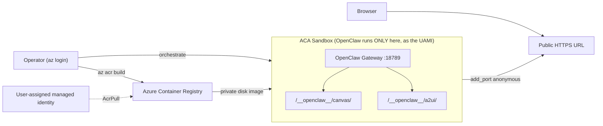

# Shopping Claw 🦞🛒

A conversational shopping concierge built on [OpenClaw](https://docs.openclaw.ai)
that runs **only inside an Azure Container Apps Sandbox** and exposes its
**canvas + A2UI** surfaces through the OpenClaw gateway.

OpenClaw is never installed or executed on your machine. A custom
bring-your-own-container (BYOC) image bakes OpenClaw + the shopping-claw skill
into a sandbox disk image; the gateway is started inside the sandbox and its
HTTP server (which hosts the canvas and A2UI) is published through the sandbox
ingress.

The agent authenticates to Azure through a **user-assigned managed identity** —
the sandbox group runs as that identity, the BYOC image is pulled from ACR with
it (AcrPull), and code inside the sandbox uses it via `AZURE_CLIENT_ID` (no
secrets). When `AZURE_OPENAI_ENDPOINT` is set, the model is reached through the
same identity instead of an API key.

## Architecture



Per the [OpenClaw architecture](https://docs.openclaw.ai/concepts/architecture),
a single gateway serves the canvas host at `/__openclaw__/canvas/` and the A2UI
host at `/__openclaw__/a2ui/` on the gateway port (default `18789`).

## Files

| File | Purpose |
| --- | --- |
| [Dockerfile](Dockerfile) | Custom BYOC image — bakes Node 24 + OpenClaw + the skill |
| [openclaw.json](openclaw.json) | Gateway config template (rendered from env at boot) |
| [start-gateway.sh](start-gateway.sh) | Renders config + starts the gateway in-sandbox |
| [skills/shopping/SKILL.md](skills/shopping/SKILL.md) | Shopping Claw persona + canvas behaviour |
| [shopping_claw.py](shopping_claw.py) | Orchestrator: disk image → sandbox → gateway → public URLs |
| [../../../scripts/build_narrator_image.py](../../../scripts/build_narrator_image.py) | Remote ACR build (no local Docker) |

## Prerequisites

- `az login` completed, with permission to **create role assignments** (Owner
  or User Access Administrator) at the resource-group scope.
- An Azure Container Registry. Set `AZURE_CONTAINER_REGISTRY_ENDPOINT`.
- A model: either set `AZURE_OPENAI_ENDPOINT` (reached via the managed identity)
  or a provider key (default `OPENAI_API_KEY`).

The orchestrator assigns these automatically: **Container Apps SandboxGroup Data
Owner** to you and to the managed identity, **AcrPull** to the identity on the
registry, and (if `AZURE_OPENAI_ACCOUNT_ID` is set) **Cognitive Services OpenAI
User** to the identity on the Azure OpenAI account.

## Usage

1. **Remote-build the image in ACR** (runs in the cloud, no local Docker):

   ```bash
   python scripts/build_narrator_image.py
   ```

2. **Boot the sandbox and expose the canvas + A2UI**:

   ```bash
   python src/agents/narrator/shopping_claw.py
   ```

   The script prints the public canvas and A2UI URLs, then waits for you to
   press Enter before deleting the sandbox.

## Configuration

Set these in `.env` at the repo root or as environment variables:

| Variable | Default | Notes |
| --- | --- | --- |
| `AZURE_CONTAINER_REGISTRY_ENDPOINT` | — | **Required.** ACR login server, e.g. `myacr.azurecr.io` |
| `NARRATOR_IMAGE_TAG` | `shopping-claw:latest` | image:tag to build / boot |
| `RESOURCE_GROUP_NAME` | `aca-sandboxes-rg` | Azure resource group |
| `SANDBOX_GROUP_NAME` | `shopping-claw` | sandbox group name |
| `LOCATION` | `westus3` | Azure region |
| `OPENCLAW_VERSION` | `latest` | openclaw npm version baked into the image |
| `OPENCLAW_PROVIDER` | `openai` | model provider id (key-based fallback) |
| `OPENCLAW_PROVIDER_API_KEY_ENV` | `OPENAI_API_KEY` | env var holding the provider key |
| `OPENCLAW_MODEL` | `gpt-5.4` | default model |
| `OPENCLAW_GATEWAY_AUTH_MODE` | `token` | `token` (generated secret) or `none` |
| `AZURE_MANAGED_IDENTITY_RESOURCE_ID` | — | use an existing user-assigned identity (else one is created) |
| `MANAGED_IDENTITY_NAME` | `shopping-claw-identity` | name of the identity to create/reuse |
| `AZURE_OPENAI_ENDPOINT` | — | when set, the model is reached via the managed identity (no key) |
| `AZURE_OPENAI_ACCOUNT_ID` | — | AOAI account ARM id to grant the identity the OpenAI User role |

## Security notes

- The gateway port is published **anonymously** through the sandbox ingress, so
  it is reachable from the public internet. Keep `OPENCLAW_GATEWAY_AUTH_MODE=token`
  (the default) for any non-throwaway run — the orchestrator generates a
  shared-secret token and appends it to the printed URLs. Only use `none` for
  fully private ingress.
- The agent authenticates to Azure as a **user-assigned managed identity** — no
  ACR password, no Azure credential, and (with `AZURE_OPENAI_ENDPOINT`) no model
  API key is stored anywhere. The identity's `clientId` is seeded as
  `AZURE_CLIENT_ID` inside the sandbox.
- A freshly-assigned **AcrPull** role can take a few minutes to propagate, so the
  disk-image pull retries on `401`. If it still can't pull via the identity, the
  orchestrator falls back to a short-lived ACR token for the pull only — the
  running agent still authenticates as the managed identity.
- Any provider key and the gateway token are injected as sandbox env vars at boot
  and are **never baked into the image**.
- The sandbox (and the public port) are deleted on exit.
